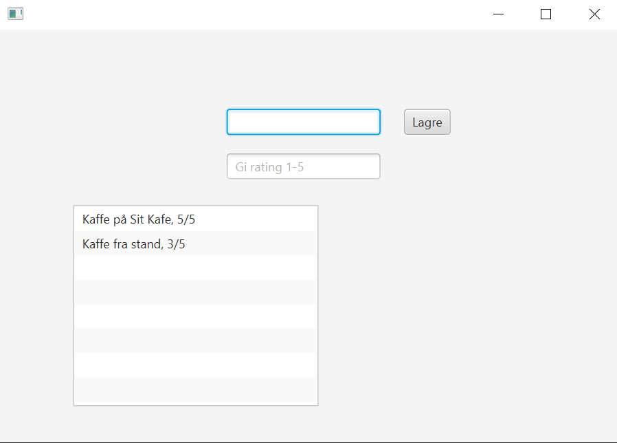

# Release 1
## Contents
The code project now contains a fundamental version of coffee rating. Here you are able to write a place and a rating, which is saved as a json-object when the save button is pressed. When the place and review is saved, they are shown in a textbox below the input fields.

## Development method
For development we have used issues in GitLab. A milestone for release 1 has been created in GitLab, which is connected to the issues we have worked on for this release. We have also made an issue for the user story we have worked on, and connected the issues relating to the user story to the user story issue. Issues are assigned to the person working on them, and added one of the labels: "not started", "in progress", "done". The issues are also labeled if they are related to: "Documentation", "Infrastructure", "Tests".
Branching in Git is used. When working on an issue, a new branch is created, and a merged into master when the work is completed.

## Design

The design of the app in this release is shown in the following picture.

