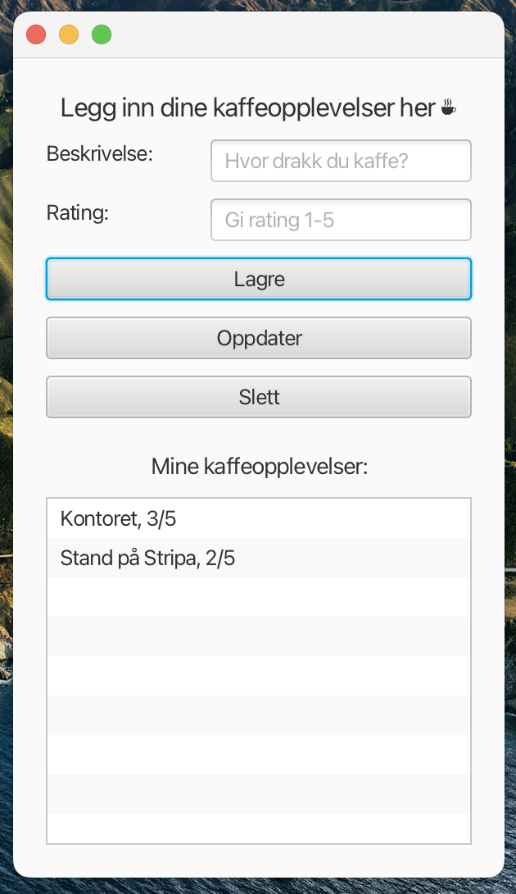

# Release 3

In this release, we had to decide whether we wanted to improve the JavaFX app with more functionality or create a new client using different technology. Since we didn't have much experience with other relevant technologies, we chose to add new functionality and continue with the current technology. We did this by adding the capability to update and delete coffee ratings.

## Development method

The development method is the same as in release1 and release2, the only difference is that we focused on writing good comments in the code, both for our own benefit to make it easier to maintain the code and write tests etc., and to improve readability for those who haven't seen the code before. We have tried to be consistent in how we write commits and to have as few changes as possible per commit; however, this has somewhat slipped towards the end as we felt the pressure of time constraints, and unfortunately, some things were forgotten.

## REST-API

In this project we have used Springboot to build a REST-server and implemented a corresponding REST-API class in the fxui module, to let the application communicate with the server.
The springbooot/restserver consist of 3 files; CoffeeRatingModelApplication.java, CoffeeRatingModelController.java and CoffeeRatingModelService.java that together builds the server. The app communicates with the server trough the RemoteCoffeeRatingModelAccess class.

We have 3 main API calls, GET model, GET rating and PUT rating. Theese are the correspondning requests and responses:

### GET model

Request: http://localhost:8080/coffeerating/ GET
Response: (GET http://localhost:8080/coffeerating/) 200

### GET rating

Request: http://localhost:8080/coffeerating//rating/ratings/ GET
Response: true

### PUT rating

Request: http://localhost:8080/coffeerating/rating/ratings/ PUT
Response: true

The JSON format is this:

{
"ratings": [
{
"name": "ratings",
"items": [
{
"description": "Kaffe fra Sit",
"rating": 3
},
{
"description": "Kaffe fra Gløs",
"rating": 4
}
]
}
]
}

## Shippable Product

We have configured the project for shippable product using jlink and jpackage. To use this you need to install wix tools and then open by using the commandos ‘mvn clean install -DskipTests’, then ‘mvn javafx:jlink -f ./fxui/pom.xml’ and then ‘mvn jpackage:jpackage -f ./fxui/pom.xml’.

## Functionality

We have chosen to implement CRUD-functionality where the user is able to create an item, read, update and delete it. This is because the project's requirements were quite open, and we wanted to keep the app simple and rather focus on making it work as well as we could. This is also the reason why the update-logic is implemented as a “create and delete”; to give us the opportunity to focus on other parts of the code.

### How to use the application

When you launch the application, a new window should pop up. To add a new object to the list, you write a description in the top textfield and then you can give a rating (from 1 to 5) in the textfield below it. When you press the “Lagre”-button, you should be able to see what you wrote in the list field. If you press an element in the list, you can remove it from the list by pressing “delete”, or update it by pressing “oppdater”, editing the name and/or rating in the textfield and then press “lagre”.

## Tests

We have written tests for a significant portion of the code, including the functions in the UI controller, most of the core logic, and the serializers and deserializers in the JSON module. The test coverage for the core is **84% (CHANGE)**, and for the FXUI, it is **64% (CHANGE)** test coverage. You can find the test coverage in the JaCoCo reports generated after running 'mvn test.' These reports are located at gr2343/core/target/site/index.html and gr2343/fxui/target/site/index.html, respectively. Unfortunately, we have not found out how to open these in eclipse che, so we have included screenshots of how it looks when it runs locally on our computer. The reports are found in docs/images/JaCoCo-core.png and docs/images/JaCoCo-fxui.png.

One of the reasons we don't have 100% test coverage in FXUI is that we don't have direct tests for CoffeeRatingApp. This is because we have implicitly tested that the app runs by testing its functionality. If the app didn't run, its functionality wouldn't work correctly either.

We don't have test coverage in springboot because of technical issues we were not able to solve. The attempted test is commented out to ensure that the app fucntion. Will further explain in challenges.md.

Another reason is that we have 68% test coverage on the controller (CoffeeRatingController). This is because we haven't been able to test whether the pointer clicks on an item in our list, and then updates or deletes the associated item. However, we know that this works when the app is running, as we have tested it manually. Therefore, we believe it wasn't worthwhile to spend a lot of time on this and instead focus on other parts of the code.

We have also used SpotBugs and CheckStyle. Their task is to improve code quality, identify potential errors, and ensure that best coding practices are followed. SpotBugs' main task is to find errors and potential bugs, while CheckStyle helps maintain a consistent style and code format, which can enhance the readability and maintainability of the project. These tools work well. By running 'mvn verify,' we get that we have 0 CheckStyle violations, and by running 'mvn spotbugs:spotbugs,' we only get two warnings, which we did not succeed in removing.

We have usually written the tests after writing the code, but sometimes we have written tests that we realize are missing, only to find out that there was something wrong in the code. So, one could say that we have been somewhat into test-driven development, or at least test-driven debugging.

## Diagrams

### Packet diagram

We have created a package diagram for the packages in the project; core and fxui. The diagram is located in docs/diagrams/package_diagram.puml.

### Class diagram

We have created a class diagram with the most important classes, namely the core classes CoffeeRatingItem, CoffeeRatings, and CoffeeRatingModel. The diagram is located in docs/diagrams/class_diagram.puml.

### Sequence diagram

A sequence diagram is made, displaying the core-classes; their attributes and methods, as well as associations between the classes and information about their cardinality. The diagram is located in docs/diagrams/sequence_diagram.puml.

## Design

With the new functionality delete and update we added new buttons ('Slett' and 'Oppdater'). We also made it more intuitive for the user.

