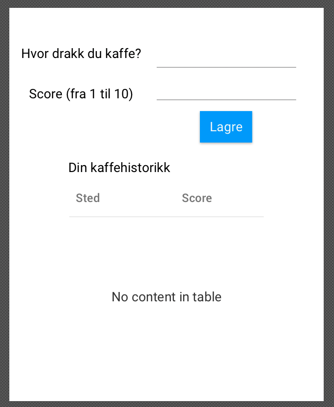

# Group gr2343 repository

# About

This code project contains coffee rating, a personal ratingsystem for coffee. It allows the user to log and review coffee locations.

## Installation

0. If you don't have an acces token on eclipse che, you need to add one first.
1. Open project by clicking the link: (https://che.stud.ntnu.no/#https://gitlab.stud.idi.ntnu.no/it1901/groups-2023/gr2343/gr2343/-/tree/master?new)
2. Change directory by running 'cd gr2343'
3. Install modules by running 'mvn clean install -DskipTests' (no need to run tests twice)
4. Run tests by running 'mvn test'
5. Run spotbugs and checkstyle by running 'mvn verify'
6. Run project by running 'mvn javafx:run -f ./fxui/pom.xml'
7. In Eclipse Che go to Endpoints->Public and copy the link for 6080-tcp-desktop-ui
8. Open the link in a new tab

## Structure and Maven build

The project is made with JavaFX, and data is stored and read from JSON-objects.

The maven build requires Maven version 3.8.1, Java version 17, JavaFX version 20 and Jackson version 2.13.4.

## User stories

- As a user, I want to review the coffee I'm drinking.
