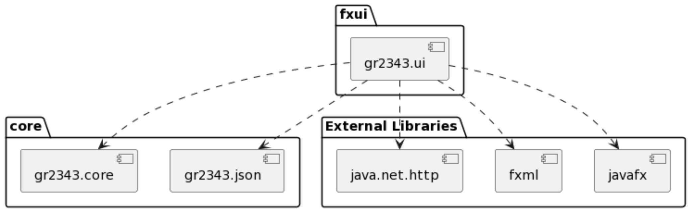

# IT1901 gr2343

[open masterbranch in Eclipse Che](https://che.stud.ntnu.no/#https://gitlab.stud.idi.ntnu.no/it1901/groups-2023/gr2343/gr2343/-/tree/master?new)

## About

This project was developed in the course IT1901 at NTNU.
This repository contains Coffee rating, a personal app for logging and rating coffee.
More info about the project, including "how-to-run" is found in gr2343/readme.md

## Folder structure

- .vscode:
  contains settings for vscode
- docs:
  contains documentation for each release and images used for documentation.
- gr2343:
  contains the code project. - config:
  contains the configuration for spotbugs and checkstyle. - core:
  contains the core-module of the code project. - fxui:
  contains the UI-module of the code project.

Three diagrams (packet-, sequence- and class) is provided in the folder docs/diagrams.
The following image is the packet diagram.

